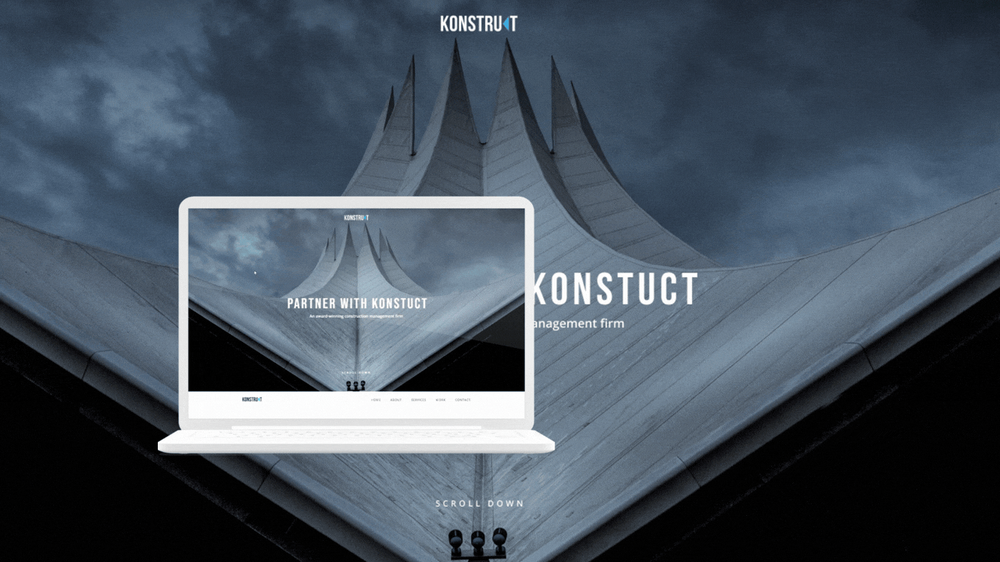

<h1 align="center"><a href=" https://kosmonavt888.github.io/Konstruct/" target="_blank">Konstruct</a></h1>

Website layout based on a Figma desing project

<h2>Features</h2>
<ul>
    <li>The website is designed using PerfectPixel technology and fully conforms to the layout.</li>
    <li>The adaptive version for devices of different sizes is made according to its own design.</li>
    <li>On devices smaller than 1440px, the background of the header section is animated by setting keyframes and the animation property.</li>
    <li>Hover effect is used when focusing on a menu item.</li>
    <li>Slide out menu in the adaptive version using the Materialize framework.</li>
    <li>In the contacts section there are icons with social networks with active links.</li>
 </ul>
 <h2>Getting Started</h2>
 <a href ="https://kosmonavt888.github.io/Konstruct/">https://kosmonavt888.github.io/Konstruct/</a>
 <h2>Technologies and Tools</h2>
 <ul>
    <li></li>
    <li></li>
    <li></li>
    <li></li>
    <li></li>
    <li></li>
</ul>
<h2>Project Features</h2>

The project was completed as part of a course on frontend development

<h2>The authors</h2>
<h1 align="start"> <a href="https://github.com/Kosmonavt888" target="_blank">
Alexandra Kalyakina</a></h1>
